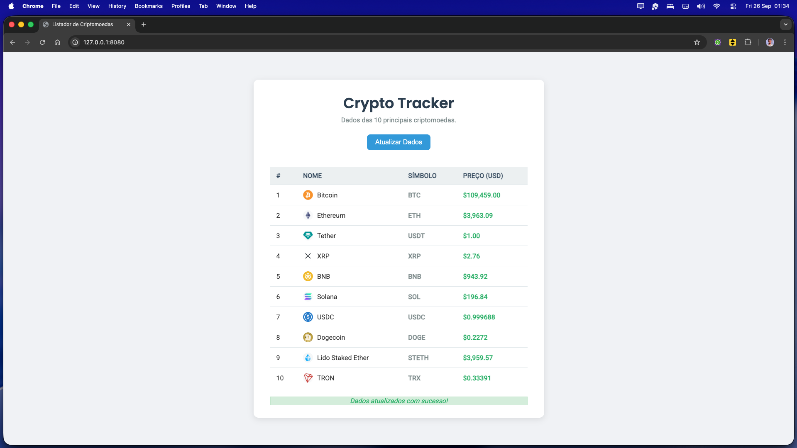
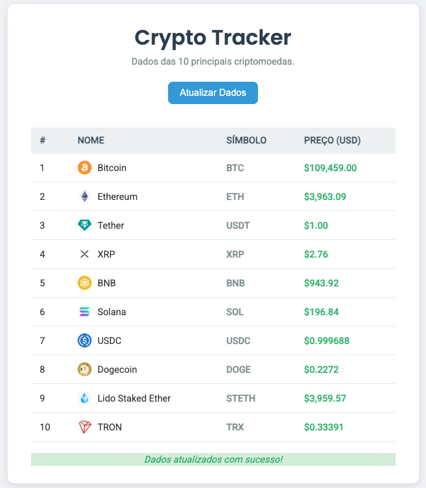

# 🚀 Listador de Criptomoedas

> Projeto pessoal desenvolvido para aprimorar minhas hard skills em desenvolvimento front-end

## 📖 Sobre o Projeto

O **Listador de Criptomoedas** é uma aplicação web que exibe em tempo real as 10 principais criptomoedas do mercado, consumindo dados da API CoinGecko. O projeto foi desenvolvido com foco no aprendizado e aprimoramento de habilidades técnicas fundamentais do desenvolvimento web.

## 📸 Preview da Aplicação

<div align="center">




*Interface principal da aplicação mostrando a lista das principais criptomoedas*

</div>

## 🎯 Objetivos de Aprendizado

Este projeto foi criado como um laboratório prático para desenvolver e consolidar conhecimentos em:

### 🛠️ Tecnologias Utilizadas

- **HTML5**: Estruturação semântica da aplicação
- **CSS3**: Estilização moderna com Flexbox e design responsivo
- **JavaScript ES6+**: Programação orientada a objetos e manipulação do DOM
- **APIs REST**: Consumo de dados externos via Fetch API
- **Git**: Controle de versão e boas práticas de commit

### 💡 Habilidades Desenvolvidas

#### **JavaScript Avançado**
- ✅ Programação orientada a objetos (Classes)
- ✅ Promises e programação assíncrona
- ✅ Manipulação dinâmica do DOM
- ✅ Array methods (forEach, push)
- ✅ Template literals e formatação de dados

#### **Integração com APIs**
- ✅ Consumo de API REST (CoinGecko API)
- ✅ Tratamento de dados JSON
- ✅ Estados de loading e feedback visual
- ✅ Gerenciamento de requisições HTTP

#### **UI/UX e CSS**
- ✅ Design responsivo
- ✅ Feedback visual para o usuário
- ✅ Animações e transições
- ✅ Tipografia moderna (Google Fonts)
- ✅ Sistema de cores consistente

#### **Boas Práticas de Desenvolvimento**
- ✅ Separação de responsabilidades (MVC pattern)
- ✅ Código limpo e bem estruturado
- ✅ Nomenclatura consistente
- ✅ Tratamento adequado de erros

## 🖥️ Funcionalidades

- 📊 **Listagem das Top 10 Criptomoedas** por market cap
- 🔄 **Atualização em tempo real** dos dados
- 🖼️ **Ícones das criptomoedas** para melhor identificação
- 💰 **Formatação de preços** em dólar americano
- 📱 **Design responsivo** para diferentes dispositivos
- ⚡ **Estados de loading** e mensagens de feedback
- 🎨 **Interface moderna** e intuitiva

## 🏗️ Estrutura do Projeto

```
ListadorDeCripto/
├── index.html              # Estrutura principal da aplicação
├── assets/
│   ├── css/
│   │   └── global.css      # Estilos globais e responsivos
│   └── js/
│       ├── cryptoApi.js    # Modelo de dados (Classe Crypto)
│       └── main.js         # Lógica principal e manipulação DOM
└── README.md               # Documentação do projeto
```

## 🚀 Como Executar

1. **Clone o repositório**
   ```bash
   git clone https://github.com/EnzoGRodrigues/ListadorDeCripto.git
   ```

2. **Navegue até o diretório**
   ```bash
   cd ListadorDeCripto
   ```

3. **Abra o arquivo index.html**
   - Você pode abrir diretamente no navegador
   - Ou usar um servidor local (Live Server, Python HTTP Server, etc.)

4. **Pronto!** 🎉 
   - A aplicação carregará automaticamente os dados das criptomoedas
   - Use o botão "Atualizar Dados" para refresh manual

## 🌐 API Utilizada

- **CoinGecko API**: API gratuita para dados de criptomoedas
- **Endpoint**: `https://api.coingecko.com/api/v3/coins/markets`
- **Parâmetros**: 
  - `vs_currency=usd` (preços em dólar)
  - `order=market_cap_desc` (ordenação por market cap)
  - `per_page=10` (limite de 10 resultados)

## 📚 Conceitos Aplicados

### **Clean Code**
- Funções com responsabilidades bem definidas
- Variáveis com nomes descritivos
- Código comentado onde necessário
- Estrutura modular e reutilizável

### **Programação Assíncrona**
```javascript
// Exemplo de Promise chain usado no projeto
function getCryptoDetails() {
    return fetch(url)
        .then((response) => response.json())
        .then(convertCrypoApi)
}
```

### **Orientação a Objetos**
```javascript
// Classe modelo criada para estruturar os dados
class Crypto {
    name;
    img;
    currentPrice;
    symbol;
}
```

### **Manipulação DOM Dinâmica**
```javascript
// Criação dinâmica de elementos HTML
const row = document.createElement('tr')
const nameCell = document.createElement('td')
tableBody.appendChild(row)
```

## 🔄 Próximos Passos

Como projeto de aprendizado contínuo, planejo implementar:

- [ ] **Cache de dados** para melhor performance
- [ ] **Filtros e busca** por criptomoedas específicas
- [ ] **Gráficos de preços** com Chart.js
- [ ] **Dark mode** toggle
- [ ] **Paginação** para mais resultados
- [ ] **Testes unitários** com Jest
- [ ] **PWA features** (Service Workers, offline support)

## 👨‍💻 Desenvolvedor

**Enzo G. Rodrigues**
- 🎯 Foco em desenvolvimento back-end (Node.js) mas buscando o full-stack.
- 📈 Constantemente aprimorando habilidades técnicas
- 🌱 Sempre em busca de novos desafios e tecnologias

---

<div align="center">

**Desenvolvido como projeto de aprendizado**

</div>